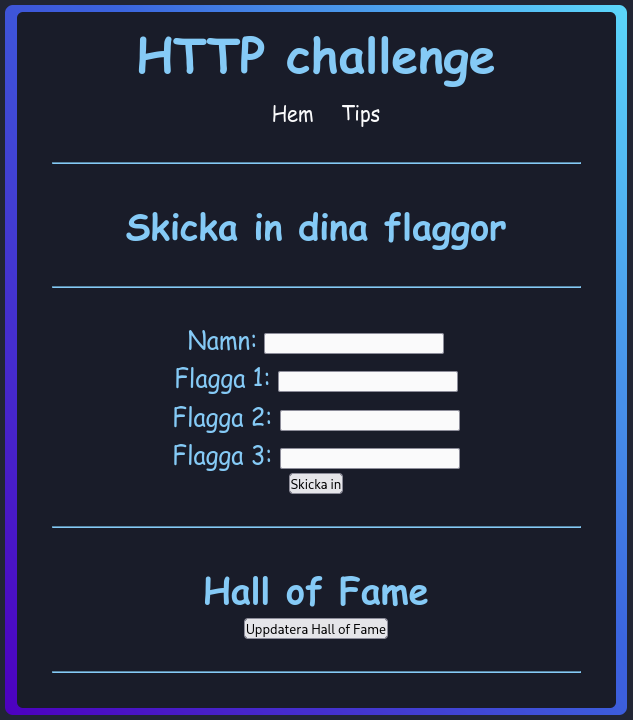

# HTTP Basics – En enkel HTTP CTF

**HTTP Basics** är en nybörjarvänlig CTF där du lär dig grunderna i HTTP. Du kommer att behöva använda webbläsarens utvecklingsverktyg, `curl`, eller verktyg som **Burp Suite** eller **Caido** för att lösa utmaningarna.

Tre flaggor finns gömda i applikationen. Varje flagga skickas in via ett formulär i frontend.



---
## Docker

```bash
git clone https://github.com/ettelman/HTTP-Basics.git
cd HTTP-Basics
```

```bash
docker build -t http-basics .
docker run -p 3000:3000 http-basics
```

## 🛠 Installation

För att köra applikationen lokalt behöver du **Node.js** installerat.

### 1. Klona repot

```bash
git clone https://github.com/ettelman/HTTP-Basics.git
cd HTTP-Basics
```

### 2. Installera beroenden

```bash
npm install
```

### 3. Starta servern

```bash
node server
```

Servern körs på <http://localhost:3000>
(Ändra port variabeln för att välja en annan port)

Skapad av: Björn Ettelman
